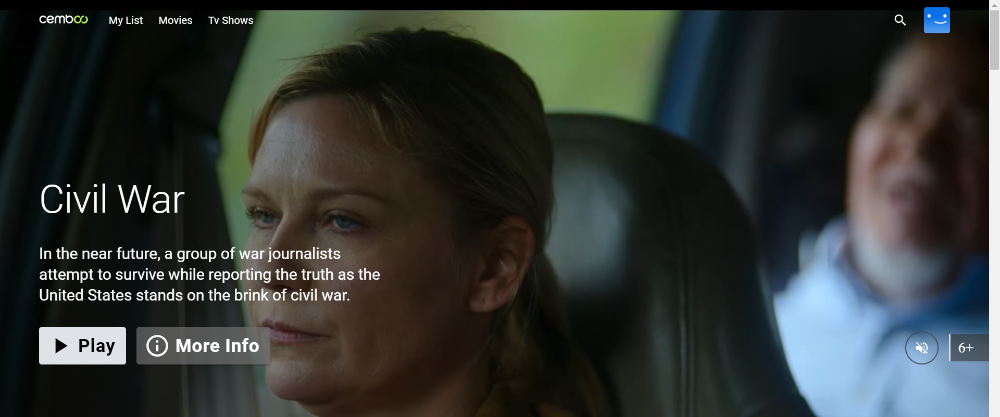
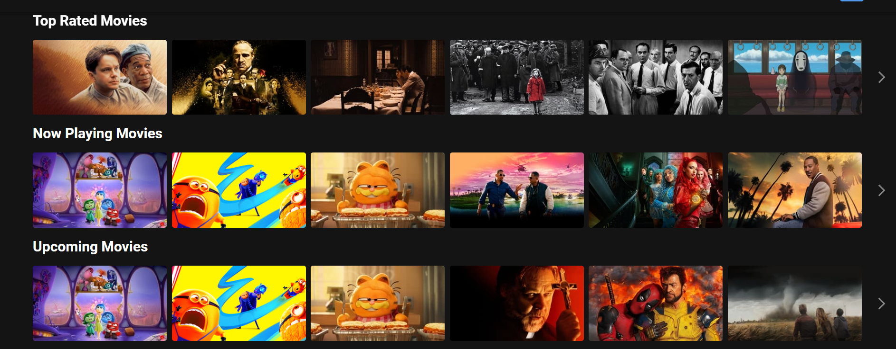
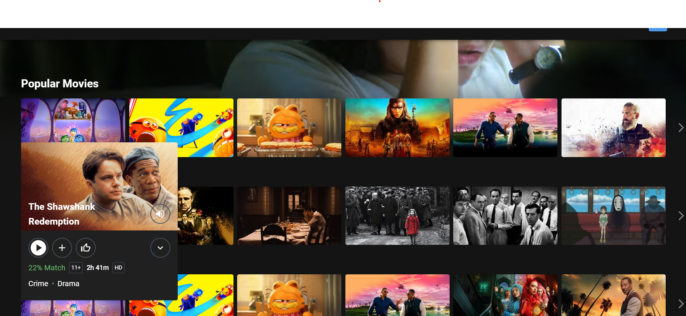
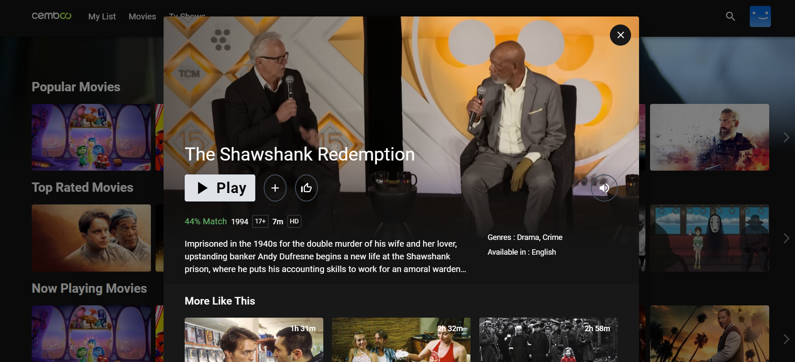

# Cemboo - Demo Streaming App

## Getting Started

Follow these instructions to set up and run the project on your local machine.

### Prerequisites

Ensure you have the following installed on your local machine:

- [Node.js](https://nodejs.org/) (Recommended: v20.17.0)
- [npm](https://www.npmjs.com/) (Usually comes with Node.js)

### Installation

1. **Clone the repository**

   ```
   git clone <repository-url>
   ```

   Navigate to the project directory

   ```
   cd <folder-name>
   ```

   Install the dependencies

   ```
   npm install
   ```

   Run the development server

   ```
   npm run dev
   ```

   Running the Application

**After completing the above steps, the application will be accessible at:**

http://localhost:5173

### Project Features

- **Movie Video Streaming Home Banner Section:** The home page features a banner section that highlights a featured movie, providing a visually appealing entry point to the app.



- **Carousel List of Movies Grouped by Genres:** Movies are displayed in a carousel format, grouped by genres, making it easy for users to browse through different categories.



- **Hover Detail Cards:** When hovering over a movie card, detailed information about the movie is displayed in a hover card, providing a quick overview without navigating away from the page.



- **Detail Hover Card Video and Similar Videos Section:** Clicking the down arrow on the detail hover card expands the card to show the relevant movie video along with a section of similar videos, enhancing the user's discovery experience.



### Project Structure

Following layout shows the project structure for further understanding

```
src/
    ├── assets/ # Static assets (images, fonts, etc.)
    ├── components/ # Reusable UI components
    ├── hooks/ # Custom hooks
    ├── pages/ # Page components
    ├── styles/ # Global and component-specific styles
    ├── utils/ # Utility functions
    ├── App.tsx # Main application component
    └── main.tsx # Entry point of the application
```

### Contact

If you have any questions or need further assistance, please contact:

Muhammad Furqan Hameed
furqanhameed558@gmail.com
[My Social Links](https://linktr.ee/furqan558)
